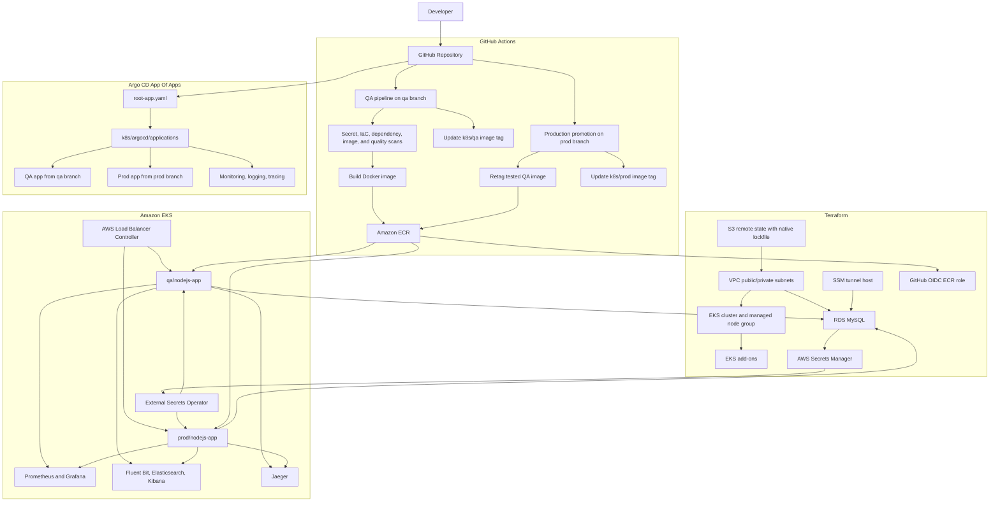

# Production Grade DevSecOps

A production-style DevSecOps portfolio project that provisions AWS infrastructure with Terraform, builds and secures a Node.js/React application, deploys it to Amazon EKS with Argo CD, and wires in secrets, monitoring, logging, tracing, and cleanup workflows.

The application is a small User Management app. The platform around it is the main point of the project: repeatable infrastructure, GitHub Actions CI/CD, container delivery to Amazon ECR, Kubernetes deployment, External Secrets, AWS-managed database access, and an observability stack.

## Architecture

### High-Level Flow

```text
Developer
  -> pushes code to GitHub branches

GitHub Actions
  -> scans source, IaC, Kubernetes manifests, Dockerfile, dependencies, and images
  -> builds the React frontend and Node.js container image
  -> pushes images to Amazon ECR
  -> updates QA and production Kubernetes manifests

Terraform
  -> creates remote state storage
  -> provisions AWS networking, EKS, ECR, RDS MySQL, IAM, add-ons, and secrets
  -> installs core EKS add-ons through Terraform-managed Helm releases

Argo CD
  -> bootstraps application-of-applications GitOps
  -> deploys QA from the qa branch
  -> deploys production from the prod branch
  -> deploys platform and observability resources from main

Amazon EKS
  -> runs the Node.js app in qa and prod namespaces
  -> exposes the app through AWS Application Load Balancers
  -> syncs database credentials from AWS Secrets Manager
  -> emits metrics, logs, and traces into the observability stack

Amazon RDS MySQL
  -> stores application data
  -> uses separate QA and production databases and users
```

### Runtime Request Flow

```text
Browser
  -> AWS ALB Ingress
  -> Kubernetes Service nodejs-service
  -> Express app on port 5000
  -> /api/users routes
  -> MySQL connection pool
  -> Amazon RDS MySQL
```

The same Express server also serves the compiled React frontend from `client/public`, exposes Prometheus metrics at `/metrics`, emits JSON request logs, and can export OpenTelemetry traces to Jaeger when `OTEL_EXPORTER_OTLP_TRACES_ENDPOINT` is set.

### Infrastructure Diagram



### GitOps Branch Model

```text
main
  -> Terraform modules and environment
  -> Argo CD root app
  -> platform and observability applications

qa
  -> k8s/qa application manifests
  -> QA pipeline updates the QA image tag
  -> Argo CD QA app is automated with prune and self-heal

prod
  -> k8s/prod application manifests
  -> production pipeline promotes a tested QA image
  -> production Argo CD app is defined separately for controlled promotion
```

If this repository is forked, update every hard-coded repository reference before cloud deployment:

- `terraform/environments/prod/main.tf`, `github_repository`.
- `k8s/argocd/root-app.yaml`, `repoURL`.
- Files in `k8s/argocd/applications/`, `repoURL`.
- GitHub Actions branch and repository settings as needed.

## Tools And Components Used

| Area | Tools | Purpose |
| --- | --- | --- |
| Frontend | React 17, Webpack 5, Babel, CSS loaders | Builds the User Management UI into static assets. |
| Backend | Node.js 24, Express, CORS, body-parser, `mysql` package | Serves the API, frontend, and database-backed CRUD routes. |
| Database | MySQL 8 locally, Amazon RDS MySQL in AWS | Stores users and supports separate QA/prod databases. |
| Metrics | `prom-client`, Prometheus, ServiceMonitor, Grafana | Exposes and visualizes Node.js and HTTP request metrics. |
| Tracing | OpenTelemetry SDK, OTLP HTTP exporter, Jaeger | Sends traces from the Node.js app to Jaeger in Kubernetes. |
| Logging | JSON app logs, Fluent Bit, Elasticsearch, Kibana | Collects Kubernetes logs and makes them searchable. |
| Local runtime | Docker, Docker Compose | Runs the app and MySQL together on a laptop. |
| Container build | Dockerfile, Docker Buildx, QEMU | Builds the production container image. |
| Registry | Amazon ECR | Stores QA, latest, manual, and production image tags. |
| Infrastructure as Code | Terraform, AWS provider, Kubernetes provider, Helm provider, MySQL provider, Random provider | Creates AWS resources, add-ons, storage classes, database users, and secrets. |
| AWS platform | VPC, public/private subnets, Internet Gateway, optional NAT Gateway, EKS, IAM, EKS Pod Identity, EBS CSI, ALB, RDS, Secrets Manager, SSM Session Manager, S3 | Provides cloud networking, compute, storage, access, secrets, and remote state. |
| Kubernetes | Deployments, Services, Ingresses, Namespaces, Secrets, StorageClass | Runs the workload and platform services. |
| GitOps | Argo CD app-of-apps | Syncs Kubernetes state from Git. |
| Secrets | AWS Secrets Manager, External Secrets Operator, Kubernetes Secrets | Keeps database and Grafana credentials out of Git. |
| CI/CD | GitHub Actions, GitHub OIDC, AWS Actions | Runs scans, builds images, pushes to ECR, and updates manifests. |
| Security scanning | Gitleaks, Checkov, Trivy, SonarQube | Scans secrets, Terraform, Kubernetes, Dockerfile, dependencies, image vulnerabilities, and code quality. |
| SBOM | Anchore SBOM Action | Generates source and image SBOM files in SPDX JSON format. |
| Operations | AWS CLI, kubectl, Helm, curl, Session Manager plugin | Day-to-day deployment, verification, port-forwarding, and cleanup. |

## Repository Layout

```text
.
|-- Dockerfile
|-- docker-compose.yml
|-- README.md
|-- RUNBOOK.md
|-- client/
|   |-- package.json
|   |-- webpack.config.js
|   |-- public/
|   `-- src/
|-- server/
|   |-- package.json
|   |-- server.js
|   |-- tracing.js
|   |-- config/
|   |-- controllers/
|   |-- models/
|   `-- routes/
|-- .github/
|   `-- workflows/
|       |-- qa-cicd.yaml
|       `-- prod-cd.yaml
|-- k8s/
|   |-- argocd/
|   |-- observability/
|   |-- qa/
|   `-- prod/
`-- terraform/
    |-- backend/
    |-- environments/
    |   `-- prod/
    `-- modules/
        |-- ecr/
        |-- eks/
        |-- eks-addons/
        |-- github-actions-ecr-role/
        |-- mysql-bootstrap/
        |-- rds-mysql/
        |-- ssm-tunnel-host/
        `-- vpc/
```

Important entrypoints:

- `server/server.js`: production server entrypoint used by Docker.
- `server/tracing.js`: optional OpenTelemetry setup.
- `client/src/App.js`: React UI.
- `docker-compose.yml`: local app plus MySQL stack.
- `terraform/backend`: S3 state backend resources.
- `terraform/environments/prod`: main AWS environment.
- `k8s/qa` and `k8s/prod`: app deployment manifests.
- `k8s/argocd/root-app.yaml`: app-of-apps bootstrap.

## Application Behavior

The app exposes these routes:

| Method | Path | Purpose |
| --- | --- | --- |
| `GET` | `/` | Serves the React frontend. |
| `GET` | `/api/users` | Lists users. |
| `POST` | `/api/users` | Creates a user. |
| `PUT` | `/api/users/:id` | Updates a user. |
| `DELETE` | `/api/users/:id` | Deletes a user. |
| `GET` | `/metrics` | Exposes Prometheus metrics. |

The server creates this table on startup if it does not exist:

```sql
CREATE TABLE IF NOT EXISTS users (
  id INT AUTO_INCREMENT PRIMARY KEY,
  name VARCHAR(255) NOT NULL,
  email VARCHAR(255) NOT NULL UNIQUE,
  role ENUM('Admin', 'User') NOT NULL
);
```

The production container expects these database variables:

```text
DB_HOST
DB_USER
DB_PASSWORD
DB_NAME
DATABASE_URL
```

`DATABASE_URL` is synced for compatibility, while the current app connection pool uses `DB_HOST`, `DB_USER`, `DB_PASSWORD`, and `DB_NAME`.

## Prerequisites

### Required For Local Run

- Docker Engine or Docker Desktop.
- Docker Compose v2 through `docker compose`.
- `curl` for API checks.

### Required For Cloud Run

- AWS account with permissions to create VPC, EKS, EC2, IAM, ECR, RDS, S3, Secrets Manager, ALB, and EBS resources.
- AWS CLI configured for the target account.
- AWS Session Manager plugin if your AWS CLI installation needs it for `aws ssm start-session`.
- Terraform.
- kubectl.
- Helm.
- Docker.
- GitHub repository access.
- Git branches named `main`, `qa`, and `prod` if using the provided GitOps workflow as-is.

### Optional But Supported

- SonarQube server, project, and token for the QA quality gate.
- ACM certificate and custom DNS records for HTTPS ingress.
- Argo CD CLI for manual production syncs. The Kubernetes commands in this README work without it.

## Quick Start: Run Locally

From the repository root:

```bash
docker compose up --build
```

This starts:

- `mysql`: MySQL 8.0 using a persistent Docker volume.
- `app`: the production Node.js container built from the root `Dockerfile`.
- React build: compiled inside the Docker image.
- Express: serving the API and frontend on port `5000`.

Local connection details:

```text
Application URL: http://localhost:5000
API URL:         http://localhost:5000/api/users
Metrics URL:     http://localhost:5000/metrics
MySQL host port: localhost:3307
MySQL container: mysql:3306
Database:        test_db
User:            appuser
Password:        password123
```

Expected server logs:

```text
Database connected and users table initialized or already exists.
Server is running on http://localhost:5000
```

In a second terminal, verify the API:

```bash
curl http://localhost:5000/api/users
```

Expected result on a fresh local database:

```json
[]
```

Create a test user:

```bash
curl -X POST http://localhost:5000/api/users \
  -H "Content-Type: application/json" \
  -d '{"name":"Test User","email":"test@example.com","role":"Admin"}'
```

Verify it was stored:

```bash
curl http://localhost:5000/api/users
```

Verify metrics:

```bash
curl http://localhost:5000/metrics
```

Expected metrics include:

```text
http_requests_total
http_request_duration_seconds
process_cpu_user_seconds_total
```

Open the frontend:

```text
http://localhost:5000
```

Use the UI to add a user. The list should update, and `/api/users` should return the new record.

## Stop And Clean Local Run

Stop containers but keep the MySQL volume:

```bash
docker compose down
```

Stop containers and delete local MySQL data:

```bash
docker compose down -v
```

Use `docker compose down -v` when you want the next local run to start with an empty database.

Optional local image cleanup:

```bash
docker image prune
```

## Full Cloud Run

This section deploys the full AWS and Kubernetes platform. These resources can incur cost. Run cleanup when you are finished.

### 1. Confirm AWS Identity

```bash
aws sts get-caller-identity
```

Confirm the returned account is the AWS account where you want to create EKS, RDS, ECR, Secrets Manager, ALBs, EC2, and S3 resources.

### 2. Export Terraform Secrets

Terraform reads sensitive inputs from environment variables. Do not commit these values to Git.

```bash
export TF_VAR_rds_master_username='adminuser'
export TF_VAR_rds_master_password='replace-with-strong-master-password'
export TF_VAR_qa_db_password='replace-with-strong-qa-password'
export TF_VAR_prod_db_password='replace-with-strong-prod-password'
export TF_VAR_grafana_admin_username='admin'
export TF_VAR_grafana_admin_password='replace-with-strong-grafana-password'
```

Password rules for the RDS master password:

- Use 8 to 41 characters.
- Use printable ASCII characters.
- Do not use `/`, `@`, double quote, or spaces.
- Also avoid single quote to keep shell and MySQL bootstrap commands simple.

Safe examples:

```bash
export TF_VAR_rds_master_password='StrongRDS-2026!ChangeMe'
export TF_VAR_qa_db_password='StrongQA-2026!ChangeMe'
export TF_VAR_prod_db_password='StrongProd-2026!ChangeMe'
export TF_VAR_grafana_admin_password='StrongGrafana-2026!ChangeMe'
```

Default database names and users:

```text
qa_db_name       = qa_app_db
qa_db_username   = qa_app_user
prod_db_name     = prod_app_db
prod_db_username = prod_app_user
```

Verify your current terminal has the variables:

```bash
printenv TF_VAR_rds_master_username
printenv TF_VAR_rds_master_password
printenv TF_VAR_qa_db_password
printenv TF_VAR_prod_db_password
printenv TF_VAR_grafana_admin_username
printenv TF_VAR_grafana_admin_password
```

### 3. Create Terraform Remote State Backend

```bash
cd terraform/backend
terraform init
terraform plan
terraform apply
```

Capture the generated backend bucket name:

```bash
BACKEND_BUCKET="$(terraform output -raw s3_bucket_name)"
echo "$BACKEND_BUCKET"
```

The backend bucket name is generated like this:

```text
production-grade-devsecops-state-<random-hex>
```

The backend bucket has versioning and server-side encryption enabled. It also has `prevent_destroy = true` in Terraform to avoid accidental state deletion.

### 4. Provision AWS Infrastructure

Move to the production environment:

```bash
cd ../environments/prod
terraform init -backend-config="bucket=${BACKEND_BUCKET}"
```

Run the first infrastructure apply without MySQL bootstrap:

```bash
terraform plan \
  -var='enable_mysql_bootstrap=false' \
  -var='enable_nat_gateway=false' \
  -var='eks_nodes_in_public_subnets=true'
```

```bash
terraform apply \
  -var='enable_mysql_bootstrap=false' \
  -var='enable_nat_gateway=false' \
  -var='eks_nodes_in_public_subnets=true'
```

This creates:

- VPC with public and private subnets across `eu-west-2a`, `eu-west-2b`, and `eu-west-2c`.
- Internet Gateway.
- Optional NAT Gateway support, disabled by default for lower-cost first runs.
- EKS cluster named `production-grade-devsecops-cluster`.
- Managed node group using `t3.medium` instances by default.
- EKS Pod Identity Agent.
- Amazon ECR repository named `nodejs-app`.
- AWS Load Balancer Controller.
- External Secrets Operator.
- AWS EBS CSI driver.
- `ebs-sc` gp3 Kubernetes StorageClass.
- Private RDS MySQL instance.
- SSM tunnel EC2 host.
- AWS Secrets Manager secret containers.
- GitHub Actions OIDC role for ECR.

Useful outputs:

```bash
terraform output
terraform output -raw cluster_name
terraform output -raw nodejs_app_ecr_repository_url
terraform output -raw rds_mysql_address
terraform output -raw ssm_tunnel_instance_id
terraform output -raw github_actions_ecr_role_arn
```

Configure kubectl:

```bash
aws eks update-kubeconfig \
  --region eu-west-2 \
  --name "$(terraform output -raw cluster_name)"
```

Verify nodes:

```bash
kubectl get nodes
```

### 5. Bootstrap MySQL And Write App Secrets

RDS is private. The Terraform MySQL provider connects through a local SSM port-forward to the tunnel host.

Start the tunnel and keep this terminal running:

```bash
aws ssm start-session \
  --target "$(terraform output -raw ssm_tunnel_instance_id)" \
  --document-name AWS-StartPortForwardingSessionToRemoteHost \
  --parameters "{\"host\":[\"$(terraform output -raw rds_mysql_address)\"],\"portNumber\":[\"3306\"],\"localPortNumber\":[\"3307\"]}"
```

In another terminal, go back to the Terraform production environment and export the same `TF_VAR_*` values again if needed:

```bash
cd terraform/environments/prod
```

Enable MySQL bootstrap:

```bash
terraform plan -var='enable_mysql_bootstrap=true'
terraform apply -var='enable_mysql_bootstrap=true'
```

This creates:

- QA database: `qa_app_db`.
- QA DB user: `qa_app_user`.
- Production database: `prod_app_db`.
- Production DB user: `prod_app_user`.
- MySQL grants for CRUD and table/index changes.
- Secret value for `qa/mysql_secret`.
- Secret value for `prod/mysql_secret`.
- Secret value for `monitoring/grafana_secret`.

Verify the secrets exist:

```bash
aws secretsmanager describe-secret --region eu-west-2 --secret-id qa/mysql_secret
aws secretsmanager describe-secret --region eu-west-2 --secret-id prod/mysql_secret
aws secretsmanager describe-secret --region eu-west-2 --secret-id monitoring/grafana_secret
```

The app secrets contain:

```text
DB_HOST
DB_NAME
DB_USER
DB_PASSWORD
DATABASE_URL
```

The Grafana secret contains:

```text
GRAFANA_USERNAME
GRAFANA_PASSWORD
```

### 6. Publish The Application Image

Kubernetes cannot start the app until the deployment image points to an image that exists in ECR.

#### Option A: Use GitHub Actions

Create GitHub repository variables:

```text
AWS_REGION=eu-west-2
ECR_REPOSITORY=nodejs-app
```

Create GitHub repository secrets:

```text
AWS_ROLE_TO_ASSUME=<terraform output github_actions_ecr_role_arn>
SONAR_TOKEN=<your SonarQube token>
SONAR_HOST_URL=<your SonarQube URL>
```

The QA workflow runs on pushes to the `qa` branch when application or workflow files change. It:

1. Runs Gitleaks.
2. Runs Checkov against Terraform, Kubernetes, and Dockerfile content.
3. Runs Trivy scans for client and server dependencies.
4. Runs lint and test commands if scripts exist.
5. Runs SonarQube analysis and a quality gate.
6. Builds the React client.
7. Builds the Docker image.
8. Runs Trivy against the Docker image.
9. Generates source and image SBOMs with Anchore.
10. Pushes `<github-sha>` and `latest` tags to ECR.
11. Updates `k8s/qa/app-deployment.yaml` on the `qa` branch.

The production workflow runs on the `prod` branch. It:

1. Reads the tested QA image from `k8s/qa/app-deployment.yaml`.
2. Refuses to promote `latest`.
3. Pulls the QA image.
4. Retags it as `prod-<qa-tag>`.
5. Pushes the production tag to ECR.
6. Updates `k8s/prod/app-deployment.yaml` on the `prod` branch.

#### Option B: Manually Build And Push

From `terraform/environments/prod`, capture the repository URL:

```bash
ECR_URL="$(terraform output -raw nodejs_app_ecr_repository_url)"
echo "$ECR_URL"
```

Authenticate Docker to ECR:

```bash
aws ecr get-login-password --region eu-west-2 \
  | docker login --username AWS --password-stdin "$(echo "$ECR_URL" | cut -d/ -f1)"
```

From the repository root, build, tag, and push:

```bash
docker build -t nodejs-app:manual .
docker tag nodejs-app:manual "${ECR_URL}:manual"
docker push "${ECR_URL}:manual"
```

Update the image in the QA and/or production manifest:

```bash
sed -i "s|image: .*nodejs-app:.*|image: ${ECR_URL}:manual|g" k8s/qa/app-deployment.yaml
sed -i "s|image: .*nodejs-app:.*|image: ${ECR_URL}:manual|g" k8s/prod/app-deployment.yaml
```

Commit and push the manifest changes to the branch Argo CD watches.

### 7. Bootstrap Argo CD

Install Argo CD:

```bash
kubectl create namespace argocd
kubectl apply -n argocd -f https://raw.githubusercontent.com/argoproj/argo-cd/stable/manifests/install.yaml
```

The provided Argo CD ingress uses HTTP on the ALB. Configure Argo CD server for that mode:

```bash
kubectl patch configmap argocd-cmd-params-cm \
  -n argocd \
  --type merge \
  -p '{"data":{"server.insecure":"true"}}'
```

Restart and wait:

```bash
kubectl rollout restart deployment argocd-server -n argocd
kubectl rollout status deployment argocd-server -n argocd
```

Create the Argo CD ALB ingress:

```bash
kubectl apply -f k8s/argocd/argocd-ingress.yaml
kubectl get ingress -n argocd
```

Get the initial admin password:

```bash
kubectl -n argocd get secret argocd-initial-admin-secret \
  -o jsonpath="{.data.password}" | base64 -d
```

Open the Argo CD ALB address with `http://` and sign in with:

```text
username: admin
password: <initial password from the command above>
```

Apply the root app:

```bash
kubectl apply -f k8s/argocd/root-app.yaml
```

The root app syncs `k8s/argocd/applications` from `main`, which then creates child applications for:

- ECK operator.
- Elasticsearch and Kibana.
- Monitoring ExternalSecret resources.
- kube-prometheus-stack.
- Fluent Bit.
- Jaeger.
- QA app.
- Production app.

### 8. Verify Kubernetes And GitOps

Check Argo CD applications:

```bash
kubectl get applications.argoproj.io -n argocd
```

Check core add-ons:

```bash
kubectl get pods -n kube-system
kubectl get pods -n external-secrets
kubectl get storageclass ebs-sc
```

Check observability namespaces:

```bash
kubectl get pods -n elastic-system
kubectl get pods -n logging
kubectl get pods -n monitoring
```

Check app namespaces:

```bash
kubectl get pods -n qa
kubectl get pods -n prod
kubectl get service -n qa
kubectl get service -n prod
kubectl get ingress -n qa
kubectl get ingress -n prod
```

Check External Secrets:

```bash
kubectl get externalsecret -A
kubectl describe externalsecret mysql-external-secret -n qa
kubectl describe externalsecret mysql-external-secret -n prod
kubectl get secret mysql-secret -n qa
kubectl get secret mysql-secret -n prod
kubectl get secret grafana-admin-secret -n monitoring
```

Verify the app through port-forward:

```bash
kubectl port-forward -n qa svc/nodejs-service 5000:5000
```

In another terminal:

```bash
curl http://localhost:5000/api/users
curl http://localhost:5000/metrics
```

Verify the app through the ALB:

```bash
kubectl get ingress app-ingress -n qa
kubectl get ingress app-ingress -n prod
```

Open the `ADDRESS` value from each ingress with `http://`.

### 9. Verify Observability

#### Prometheus And Grafana

Port-forward Grafana:

```bash
kubectl port-forward -n monitoring svc/monitoring-stack-grafana 3000:80
```

Open:

```text
http://localhost:3000
```

Log in with:

```text
username: value from TF_VAR_grafana_admin_username
password: value from TF_VAR_grafana_admin_password
```

Check app ServiceMonitor resources:

```bash
kubectl get servicemonitor -n qa
kubectl get servicemonitor -n prod
```

If app metrics do not appear in Prometheus, first confirm `/metrics` responds through port-forward, then confirm the ServiceMonitor selector matches the labels on `nodejs-service`.

#### Elasticsearch, Kibana, And Fluent Bit

Check logging pods:

```bash
kubectl get pods -n logging
kubectl logs -n logging ds/fluent-bit
```

Port-forward Kibana:

```bash
kubectl port-forward -n logging svc/logging-kb-kb-http 5601:5601
```

Open:

```text
https://localhost:5601
```

Get the default Elasticsearch user password if needed:

```bash
kubectl get secret logging-es-es-elastic-user -n logging \
  -o go-template='{{.data.elastic | base64decode}}'
```

Generate app traffic before searching logs:

```bash
curl http://localhost:5000/api/users
```

The app emits JSON request logs with fields such as:

```text
level
message
method
path
route
status_code
duration_ms
trace_id
```

#### Jaeger

Port-forward Jaeger:

```bash
kubectl port-forward -n logging svc/jaeger-query 16686:80
```

Open:

```text
http://localhost:16686
```

Generate app traffic:

```bash
curl http://localhost:5000/api/users
```

Expected services include:

```text
nodejs-app-qa
nodejs-app-prod
```

## HTTPS And Custom Domains

The first deployment uses HTTP through AWS ALB DNS names. This avoids needing a domain or ACM certificate during the initial run.

For HTTPS later, update these files:

```text
k8s/qa/app-ingress.yaml
k8s/prod/app-ingress.yaml
k8s/argocd/argocd-ingress.yaml
k8s/observability/values/kube-prometheus-stack-values.yaml
```

Replace the commented examples with:

- Your real domain or subdomain.
- An ACM certificate ARN in `eu-west-2`.
- HTTPS listener annotations.
- SSL redirect annotations.

Check ACM certificates:

```bash
aws acm list-certificates --region eu-west-2
```

After the ALB exists, create a DNS record pointing your domain to the ALB DNS name. In Route 53, prefer an alias record.

## Development Commands

Install and build the client:

```bash
cd client
npm ci
npm run build
```

Install and run the server directly:

```bash
cd server
npm ci
npm start
```

Direct server run expects a reachable MySQL database. Without `NODE_ENV=production`, the server falls back to:

```text
DB_HOST=localhost
DB_USER=appuser
DB_PASSWORD=password123
DB_NAME=test_db
```

Build the production image:

```bash
docker build -t nodejs-app:local .
```

Format Terraform:

```bash
terraform fmt -recursive
```

Validate the production Terraform environment after init:

```bash
terraform -chdir=terraform/environments/prod validate
```

Preview Kubernetes manifests:

```bash
kubectl apply --dry-run=client -f k8s/qa/
kubectl apply --dry-run=client -f k8s/prod/
```

Check app logs:

```bash
kubectl logs -n qa deploy/nodejs-app
kubectl logs -n prod deploy/nodejs-app
```

## Troubleshooting

### Docker Compose

Check container status:

```bash
docker compose ps
```

Check logs:

```bash
docker compose logs mysql
docker compose logs app
```

If MySQL authentication errors appear locally, reset the local volume:

```bash
docker compose down -v
docker compose up --build
```

If port `5000` or `3307` is already in use, stop the other process or change the host port mapping in `docker-compose.yml`.

### Terraform

If Terraform asks for variables again, export the `TF_VAR_*` values in the same terminal where you run Terraform.

If the backend bucket is missing during environment init, capture it again:

```bash
cd terraform/backend
BACKEND_BUCKET="$(terraform output -raw s3_bucket_name)"
```

If EKS nodes fail to join, confirm these first-run settings:

```text
enable_nat_gateway=false
eks_nodes_in_public_subnets=true
```

If the AWS Load Balancer Controller webhook blocks resources, inspect the controller:

```bash
kubectl get pods -n kube-system
kubectl get events -n kube-system --sort-by=.lastTimestamp
```

### MySQL Bootstrap

If bootstrap cannot connect, verify the SSM session is still running and local port `3307` is free.

If the app logs `ER_NOT_SUPPORTED_AUTH_MODE`, the app is using the older Node `mysql` package. Preferred fix: migrate the backend dependency to `mysql2`. Infrastructure-side workaround: ensure app DB users use `mysql_native_password`.

### Kubernetes

If pods are pending:

```bash
kubectl describe pod -n qa <pod-name>
kubectl describe pod -n prod <pod-name>
```

If pods crash:

```bash
kubectl logs -n qa deploy/nodejs-app
kubectl logs -n prod deploy/nodejs-app
```

If External Secrets fail:

```bash
kubectl describe externalsecret mysql-external-secret -n qa
kubectl describe externalsecret mysql-external-secret -n prod
kubectl describe externalsecret monitoring-external-secret -n monitoring
```

If an ingress does not get an address, check the AWS Load Balancer Controller logs and Kubernetes events.

### CI/CD

If the QA workflow fails at SonarQube, confirm:

```text
SONAR_TOKEN
SONAR_HOST_URL
```

If GitHub Actions cannot push to ECR, confirm:

```text
AWS_REGION
ECR_REPOSITORY
AWS_ROLE_TO_ASSUME
```

Also confirm Terraform created the OIDC role for the correct repository and branches.

## Cleanup

Cleanup has two tracks:

1. Local Docker cleanup.
2. Cloud cleanup for Kubernetes resources and AWS infrastructure.

Run cloud cleanup carefully. The expensive resources are usually EKS nodes, RDS, ALBs, NAT Gateways if enabled, EBS volumes, and stored ECR images.

### Local Cleanup

Stop local containers:

```bash
docker compose down
```

Delete local containers and MySQL data:

```bash
docker compose down -v
```

Optional image cleanup:

```bash
docker image prune
```

### Cloud Cleanup Order

Use this order:

1. Stop Argo CD from recreating resources.
2. Delete app and platform ingresses so AWS ALBs are removed cleanly.
3. Delete app, observability, and Argo CD Kubernetes resources.
4. Destroy Terraform-managed AWS infrastructure.
5. Empty and remove state backend only if you are fully retiring the project.

### 1. Stop GitOps Reconciliation

```bash
kubectl delete application platform-apps -n argocd --ignore-not-found
kubectl delete application user-management-qa user-management-prod monitoring-stack monitoring-resources fluent-bit jaeger elasticsearch-kibana eck-operator -n argocd --ignore-not-found
```

### 2. Delete Ingresses First

```bash
kubectl delete ingress app-ingress -n qa --ignore-not-found
kubectl delete ingress app-ingress -n prod --ignore-not-found
kubectl delete -f k8s/argocd/argocd-ingress.yaml --ignore-not-found
```

Wait for AWS load balancers to disappear:

```bash
kubectl get ingress -A
```

You can also verify in AWS:

```bash
aws elbv2 describe-load-balancers --region eu-west-2
```

### 3. Delete Kubernetes Workloads

```bash
kubectl delete -f k8s/prod/ --ignore-not-found
kubectl delete -f k8s/qa/ --ignore-not-found
kubectl delete -f k8s/observability/monitoring/ --ignore-not-found
kubectl delete -f k8s/observability/logging/ --ignore-not-found
```

Delete Argo CD itself after child resources are gone:

```bash
kubectl delete namespace argocd --ignore-not-found
```

Check for remaining namespaces and PVCs:

```bash
kubectl get ns
kubectl get pvc -A
```

If Elasticsearch PVCs remain, delete them before destroying the cluster if you do not need the data.

### 4. Prepare Terraform Destroy

If MySQL bootstrap was enabled, start the SSM tunnel again before destroy. Terraform may need the MySQL provider to remove database users and grants.

From `terraform/environments/prod`:

```bash
aws ssm start-session \
  --target "$(terraform output -raw ssm_tunnel_instance_id)" \
  --document-name AWS-StartPortForwardingSessionToRemoteHost \
  --parameters "{\"host\":[\"$(terraform output -raw rds_mysql_address)\"],\"portNumber\":[\"3306\"],\"localPortNumber\":[\"3307\"]}"
```

In another terminal, export the same `TF_VAR_*` values used during apply.

If ECR contains images, Terraform may fail to delete the ECR repository. Delete unneeded ECR images first through the AWS console or with commands like:

```bash
aws ecr list-images --repository-name nodejs-app --region eu-west-2
aws ecr batch-delete-image --repository-name nodejs-app --region eu-west-2 --image-ids imageTag=manual
```

Repeat `batch-delete-image` for tags you created, such as SHA tags, `latest`, `qa`, or `prod-*`.

### 5. Destroy AWS Infrastructure

From `terraform/environments/prod`:

```bash
terraform destroy \
  -var='enable_mysql_bootstrap=true' \
  -var='enable_nat_gateway=false' \
  -var='eks_nodes_in_public_subnets=true'
```

Use `enable_mysql_bootstrap=true` if you enabled bootstrap during the run. Use `enable_mysql_bootstrap=false` if you never enabled it. Use the same values for `enable_nat_gateway` and `eks_nodes_in_public_subnets` that you used during apply.

After destroy, verify the expensive resources are gone:

```bash
aws eks list-clusters --region eu-west-2
aws rds describe-db-instances --region eu-west-2
aws elbv2 describe-load-balancers --region eu-west-2
aws ec2 describe-nat-gateways --region eu-west-2
```

### 6. Backend Cleanup

The backend bucket is intentionally protected by this lifecycle rule:

```hcl
lifecycle {
  prevent_destroy = true
}
```

Recommended portfolio workflow: keep the backend bucket for future runs.

If you are fully retiring the project:

1. Confirm `terraform/environments/prod` has been destroyed.
2. Empty all objects and versions from the backend S3 bucket.
3. Remove or comment the `prevent_destroy` block in `terraform/backend/main.tf`.
4. Run:

```bash
cd terraform/backend
terraform destroy
```

Do not delete the backend before the environment state is destroyed or migrated.

## Security Notes

- Do not commit `.tfvars` files containing secrets.
- Do not commit AWS credentials, kubeconfigs, database passwords, or copied secret values.
- Prefer GitHub OIDC over long-lived AWS access keys.
- Keep RDS private.
- Use External Secrets rather than static Kubernetes Secret YAML files.
- Rotate the Argo CD initial admin password after first login.
- Replace HTTP-only ingress with HTTPS before exposing production-like environments to real users.

## Current Defaults

```text
AWS region:            eu-west-2
EKS cluster name:      production-grade-devsecops-cluster
EKS version variable:  1.36
Node group instance:   t3.medium
Node desired count:    3
NAT gateway:           disabled by default
EKS node subnets:      public by default for no-NAT first run
RDS engine:            MySQL
RDS network:           private subnets only
ECR repository:        nodejs-app
App container port:    5000
Local app port:        5000
Local MySQL port:      3307
```

If your AWS account or region does not support the configured EKS version, update `cluster_version` in `terraform/environments/prod/variables.tf` before applying.
