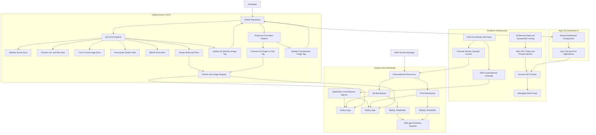

# Production Grade DevSecOps

A cloud-native DevSecOps project for provisioning AWS infrastructure, deploying a Node.js/MySQL application to Amazon EKS, and running security-focused CI/CD through GitHub Actions.

The repository is organized around three main concerns:

- Infrastructure as Code with Terraform for AWS networking, remote state, and EKS.
- Kubernetes manifests for isolated `qa` and `prod` deployments.
- CI/CD pipelines with secret scanning, IaC scanning, container scanning, linting, testing, SBOM generation, Docker image publishing, and production promotion.

## Architecture

```text
GitHub Actions
  -> security scans, lint, test, build
  -> Docker image pushed to Docker Hub
  -> QA manifest image tag updated
  -> production workflow promotes QA image to prod tag
  -> Argo CD dashboard syncs the application into the cluster

Terraform
  -> S3 + DynamoDB backend for remote state
  -> AWS VPC with public and private subnets
  -> EKS cluster and managed node group
  -> EKS Pod Identity roles for AWS Load Balancer Controller and External Secrets

Kubernetes
  -> qa and prod namespaces
  -> Node.js application deployment and service
  -> MySQL StatefulSet with EBS-backed storage
  -> External Secrets integration with AWS Secrets Manager
  -> ALB ingress through AWS Load Balancer Controller
```

## Architecture Diagram



## Repository Layout

```text
.
|-- .github/workflows/
|   |-- qa-cicd.yaml          # QA CI/CD pipeline with security gates and image publishing
|   `-- prod-cd.yaml          # Production image promotion and manifest update
|-- k8s/
|   |-- qa/                   # QA Kubernetes manifests
|   |-- prod/                 # Production Kubernetes manifests
|   `-- storage-class.yaml    # EBS gp3 StorageClass
`-- terraform/
    |-- backend/              # S3 and DynamoDB Terraform state backend
    |-- environments/prod/    # Production Terraform root module
    `-- modules/
        |-- eks/              # EKS cluster, node groups, add-ons, IAM roles
        `-- vpc/              # VPC, subnets, route tables, NAT, internet gateway
```

## Tooling

- AWS
- Terraform
- Kubernetes and kubectl
- Helm
- Docker
- GitHub Actions
- Docker Hub
- Gitleaks
- Checkov
- Trivy
- SonarQube
- Anchore SBOM action
- External Secrets Operator
- AWS Load Balancer Controller
- Argo CD dashboard UI

## Prerequisites

Before deploying, make sure you have:

- An AWS account with permissions to create VPC, EKS, IAM, S3, DynamoDB, ACM, and Secrets Manager resources.
- AWS CLI configured locally.
- Terraform installed.
- kubectl installed.
- Helm installed.
- Docker Hub credentials.
- A SonarQube project and token if using the QA workflow quality gate.
- An ACM certificate for the application ingress host.
- Secrets stored in AWS Secrets Manager for both QA and production.
- Argo CD installed and connected to this repository for dashboard-based CD.

Required GitHub repository secrets:

```text
DOCKER_USERNAME
DOCKERHUB_TOKEN
SONAR_TOKEN
SONAR_HOST_URL
```

## Terraform Deployment

### 1. Create the Remote State Backend

The backend stack creates the S3 bucket and DynamoDB table used by Terraform state locking.

```bash
cd terraform/backend
terraform init
terraform plan
terraform apply
```

Backend resources:

- S3 bucket: `production-grade-devsecops-state-bucket`
- DynamoDB table: `terraform-state-lock`
- AWS region: `eu-west-2`

### 2. Provision the Production Infrastructure

```bash
cd terraform/environments/prod
terraform init
terraform plan
terraform apply
```

The production environment creates:

- VPC with public and private subnets.
- Internet gateway and NAT gateway.
- EKS cluster.
- Managed EKS node group.
- EKS Pod Identity add-on.
- AWS Load Balancer Controller IAM role and Helm release.
- External Secrets IAM roles for `qa` and `prod`.

Default values are defined in `terraform/environments/prod/variables.tf`, including:

- Region: `eu-west-2`
- Cluster name: `opentelemetry-eks-cluster`
- Kubernetes version: `1.30`
- Node instance type: `t3.medium`
- Desired node count: `2`

### 3. Configure kubectl

After the EKS cluster is created, update your kubeconfig:

```bash
aws eks update-kubeconfig \
  --region eu-west-2 \
  --name opentelemetry-eks-cluster
```

## Secrets

The Kubernetes manifests use External Secrets Operator to sync database values from AWS Secrets Manager into Kubernetes secrets.

Expected AWS Secrets Manager keys:

```text
qa/mysql_secret
prod/mysql_secret
```

Each secret should contain these properties:

```text
MYSQL_ROOT_PASSWORD
MYSQL_DATABASE
MYSQL_USER
MYSQL_PASSWORD
DATABASE_URL
```

The Terraform EKS module creates IAM policies scoped to:

```text
arn:aws:secretsmanager:<region>:<account-id>:secret:qa/*
arn:aws:secretsmanager:<region>:<account-id>:secret:prod/*
```

## Kubernetes Deployment

Install cluster-level dependencies first, then apply environment manifests.

```bash
kubectl apply -f k8s/storage-class.yaml
kubectl apply -f k8s/qa/
kubectl apply -f k8s/prod/
```

QA resources are deployed into the `qa` namespace. Production resources are deployed into the `prod` namespace.

Continuous deployment into the cluster is handled from the Argo CD dashboard UI. Argo CD is configured through the dashboard to watch the Kubernetes manifests in this repository, so there is no additional Argo CD application manifest or CD code in this repo.

Useful checks:

```bash
kubectl get pods -n qa
kubectl get pods -n prod
kubectl get ingress -n qa
kubectl get ingress -n prod
kubectl get externalsecret -n qa
kubectl get externalsecret -n prod
```

## Application Ingress

The QA and production ingress manifests use AWS ALB annotations:

- Internet-facing ALB.
- IP target type.
- HTTP and HTTPS listeners.
- HTTP to HTTPS redirect.
- ACM certificate ARN.

Before deploying, update the placeholder values in the ingress manifests:

```text
alb.ingress.kubernetes.io/certificate-arn
spec.rules[].host
```

## CI/CD

GitHub Actions handles CI, security scanning, image publishing, and manifest updates. The actual Kubernetes CD sync is performed through the Argo CD dashboard UI after Argo CD is connected to the repository.

### QA Pipeline

Workflow: `.github/workflows/qa-cicd.yaml`

Runs on pushes to the `qa` branch when application or workflow files change.

Pipeline stages:

- Gitleaks secret scan.
- Checkov scans for Terraform, Kubernetes, and Dockerfile configuration.
- Trivy filesystem scans for client and server dependencies.
- Client and server linting.
- Client and server tests.
- SonarQube analysis and quality gate check.
- Client build.
- Docker image build.
- Trivy container image scan.
- Source and image SBOM generation.
- Docker image push to Docker Hub.
- QA Kubernetes deployment manifest image tag update.
- Argo CD dashboard sync to deploy the updated QA manifests.

Published image tags:

```text
awaismansha/nodejs-app:<github-sha>
awaismansha/nodejs-app:latest
```

### Production Pipeline

Workflow: `.github/workflows/prod-cd.yaml`

Runs on pushes to the `prod` branch when the production deployment manifest or workflow changes.

Pipeline stages:

- Pulls the QA `latest` image.
- Retags it as a production image.
- Pushes the production tag to Docker Hub.
- Updates `k8s/prod/app-deployment.yaml`.
- Commits the updated production manifest back to the `prod` branch.
- Argo CD dashboard sync to deploy the updated production manifests.

Production image format:

```text
awaismansha/nodejs-app:prod-<github-sha>
```

## Security Controls

This project includes multiple DevSecOps checks:

- Secret scanning with Gitleaks.
- Terraform scanning with Checkov.
- Kubernetes manifest scanning with Checkov.
- Dockerfile scanning with Checkov.
- Dependency and filesystem scanning with Trivy.
- Container image vulnerability scanning with Trivy.
- Source and image SBOM generation with Anchore.
- SonarQube quality gate checks.
- AWS Secrets Manager integration through External Secrets.
- EKS Pod Identity for service account permissions.
- Argo CD dashboard-based continuous deployment.

## Configuration Notes

Review these values before applying to a real AWS account:

- Replace ingress certificate ARN and hostname placeholders.
- Confirm Docker image names match your Docker Hub repository.
- Confirm GitHub branch strategy uses `qa` and `prod`.
- Confirm Argo CD is configured from the dashboard UI to track the correct branch and manifest path.
- Make sure External Secrets Operator is installed in the cluster.
- Make sure the AWS EBS CSI driver is installed for the `ebs-sc` StorageClass.
- Align Kubernetes secret names across `ExternalSecret`, application deployment, and MySQL StatefulSet manifests.
- Align `SecretStore` names referenced by `external-secret.yaml` with the `SecretStore` resources.
- Verify Terraform module file paths and outputs before running `terraform apply`.

## Common Commands

Format Terraform:

```bash
terraform fmt -recursive terraform
```

Validate Terraform:

```bash
cd terraform/environments/prod
terraform validate
```

Preview Kubernetes manifests:

```bash
kubectl apply --dry-run=client -f k8s/qa/
kubectl apply --dry-run=client -f k8s/prod/
```

Check External Secrets:

```bash
kubectl describe externalsecret mysql-external-secret -n qa
kubectl describe externalsecret mysql-external-secret -n prod
```

Check application logs:

```bash
kubectl logs -n qa deploy/nodejs-app
kubectl logs -n prod deploy/nodejs-app
```

## Cleanup

Delete Kubernetes workloads:

```bash
kubectl delete -f k8s/prod/
kubectl delete -f k8s/qa/
kubectl delete -f k8s/storage-class.yaml
```

Destroy infrastructure:

```bash
cd terraform/environments/prod
terraform destroy
```

Destroy the backend only after all environment state has been removed or migrated:

```bash
cd terraform/backend
terraform destroy
```
