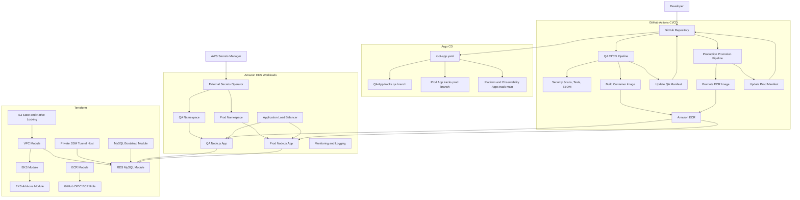

# Production Grade DevSecOps

A cloud-native DevSecOps portfolio project for provisioning AWS infrastructure, deploying a Node.js application to Amazon EKS, and running security-focused CI/CD through GitHub Actions.

The project is moving toward a reusable Terraform module layout with Amazon ECR for images, Amazon RDS for MySQL, External Secrets Operator for Kubernetes secrets, and Argo CD app-of-apps for cluster deployment.

## Architecture

```text
GitHub Actions
  -> security scans, lint, test, build
  -> container image pushed to Amazon ECR
  -> QA manifest image tag updated on the qa branch
  -> production workflow promotes the ECR image to a prod tag
  -> prod manifest image tag updated on the prod branch
  -> Argo CD syncs branch-specific Kubernetes manifests

Terraform
  -> S3 backend with native lockfile state locking
  -> reusable VPC and EKS modules
  -> reusable ECR module
  -> reusable EKS add-ons module
  -> reusable RDS MySQL and MySQL bootstrap modules
  -> private SSM tunnel host for local DB bootstrap access
  -> GitHub OIDC role for ECR access

Kubernetes
  -> qa and prod namespaces
  -> Node.js app deployments and services
  -> ExternalSecret resources backed by AWS Secrets Manager
  -> ALB ingress through AWS Load Balancer Controller
  -> observability workloads, including Elasticsearch on Terraform-owned ebs-sc storage

Database
  -> shared private Amazon RDS MySQL instance
  -> separate QA and prod databases
  -> separate QA and prod DB users
  -> DB connection values synced into Kubernetes with External Secrets
```

## Architecture Diagram



## Repository Layout

```text
.
|-- Dockerfile
|-- .dockerignore
|-- client/
|-- server/
|-- .github/workflows/
|   |-- qa-cicd.yaml
|   `-- prod-cd.yaml
|-- k8s/
|   |-- argocd/
|   |-- observability/
|   |-- qa/
|   `-- prod/
`-- terraform/
    |-- backend/
    |-- environments/
    |   `-- prod/
    `-- modules/
        |-- vpc/
        |-- eks/
        |-- eks-addons/
        |-- ecr/
        |-- rds-mysql/
        |-- mysql-bootstrap/
        |-- ssm-tunnel-host/              # planned remaining module
        `-- github-actions-ecr-role/      # planned remaining module
```

## Tooling

- AWS
- Terraform
- Kubernetes and kubectl
- Helm
- Docker
- GitHub Actions
- Amazon ECR
- Amazon RDS for MySQL
- AWS Secrets Manager
- External Secrets Operator
- AWS Load Balancer Controller
- Argo CD
- Gitleaks
- Checkov
- Trivy
- SonarQube
- Anchore SBOM action

## Prerequisites

Before deploying, make sure you have:

- AWS CLI configured locally.
- Terraform installed.
- kubectl installed.
- Helm installed.
- Docker installed.
- A SonarQube project and token if using the QA quality gate.
- An ACM certificate only if enabling HTTPS/custom-domain ingress.
- Required DB credentials available through a secret-safe Terraform workflow.
- Grafana admin credentials available through the same Terraform variable workflow.
- A private SSM tunnel host or a runner inside the VPC for MySQL bootstrap.

RDS MySQL password reminder: use 8-41 printable ASCII characters, and avoid `/`, `@`, double quote (`"`), spaces, and single quote (`'`). A simple safe pattern is `StrongRDS-2026!ChangeMe`.

Required GitHub repository variables:

```text
AWS_REGION
ECR_REPOSITORY
```

Required GitHub repository secrets:

```text
AWS_ROLE_TO_ASSUME
SONAR_TOKEN
SONAR_HOST_URL
```

`AWS_ROLE_TO_ASSUME` should be the Terraform output from the GitHub Actions ECR role.

## Terraform Deployment

### 1. Create Remote State Backend

```bash
cd terraform/backend
terraform init
terraform plan
terraform apply
BACKEND_BUCKET="$(terraform output -raw s3_bucket_name)"
```

### 2. Provision AWS Infrastructure

The production root module wires reusable modules for VPC, EKS, EKS add-ons, ECR, RDS MySQL, and MySQL bootstrap.

First apply without MySQL bootstrap:

```bash
cd terraform/environments/prod
terraform init -backend-config="bucket=${BACKEND_BUCKET}"
terraform plan \
  -var='enable_mysql_bootstrap=false' \
  -var='enable_nat_gateway=false' \
  -var='eks_nodes_in_public_subnets=true'
terraform apply \
  -var='enable_mysql_bootstrap=false' \
  -var='enable_nat_gateway=false' \
  -var='eks_nodes_in_public_subnets=true'
```

Then start an SSM tunnel to private RDS:

```bash
aws ssm start-session \
  --target "$(terraform output -raw ssm_tunnel_instance_id)" \
  --document-name AWS-StartPortForwardingSessionToRemoteHost \
  --parameters "{\"host\":[\"$(terraform output -raw rds_mysql_address)\"],\"portNumber\":[\"3306\"],\"localPortNumber\":[\"3307\"]}"
```

In another terminal, enable MySQL bootstrap:

```bash
terraform plan -var='enable_mysql_bootstrap=true'
terraform apply -var='enable_mysql_bootstrap=true'
```

For larger production systems, prefer running Terraform from inside the VPC instead of using a local tunnel.

## Database And Secrets

The application database is Amazon RDS MySQL. QA and production share the RDS instance for portfolio cost control, but they use separate databases and users.

External Secrets Operator syncs these AWS Secrets Manager secrets:

```text
qa/mysql_secret
prod/mysql_secret
```

Each secret should expose:

```text
DB_HOST
DB_NAME
DB_USER
DB_PASSWORD
DATABASE_URL
```

The Kubernetes app deployments read those keys from a Kubernetes Secret named `mysql-secret`.

## Kubernetes Deployment

Argo CD is bootstrapped manually, then the root app owns the child applications:

```bash
kubectl create namespace argocd
kubectl apply -n argocd -f https://raw.githubusercontent.com/argoproj/argo-cd/stable/manifests/install.yaml
kubectl patch configmap argocd-cmd-params-cm \
  -n argocd \
  --type merge \
  -p '{"data":{"server.insecure":"true"}}'
kubectl rollout restart deployment argocd-server -n argocd
kubectl rollout status deployment argocd-server -n argocd
kubectl apply -f k8s/argocd/argocd-ingress.yaml
kubectl apply -f k8s/argocd/root-app.yaml
```

Use the Argo CD ALB DNS name for the UI:

```bash
kubectl get ingress -n argocd
```

The QA Argo app tracks the `qa` branch. The production Argo app tracks the `prod` branch. Shared platform and observability apps stay on `main`.

Useful checks:

```bash
kubectl get applications -n argocd
kubectl get pods -n qa
kubectl get pods -n prod
kubectl get ingress -n qa
kubectl get ingress -n prod
kubectl get externalsecret -A
```

The `ebs-sc` StorageClass is Terraform-owned and is still used by Elasticsearch in the observability stack.

## CI/CD

GitHub Actions handles CI, security scanning, ECR image publishing, image promotion, and manifest updates.

### QA Pipeline

Workflow: `.github/workflows/qa-cicd.yaml`

Runs on pushes to the `qa` branch when application, container, or workflow files change.

Pipeline stages:

- Secret scanning.
- Terraform, Kubernetes, and Dockerfile scanning.
- Client and server dependency scanning.
- Client and server linting/tests.
- SonarQube analysis.
- Client build.
- Container image build and Trivy image scan.
- Source and image SBOM generation.
- Image push to Amazon ECR.
- QA manifest image update on the `qa` branch.

QA image tags:

```text
<account-id>.dkr.ecr.<region>.amazonaws.com/nodejs-app:<github-sha>
<account-id>.dkr.ecr.<region>.amazonaws.com/nodejs-app:latest
```

### Production Pipeline

Workflow: `.github/workflows/prod-cd.yaml`

Runs on pushes to the `prod` branch when the production deployment manifest or workflow changes.

Pipeline stages:

- Authenticate to AWS with GitHub OIDC.
- Pull the ECR `latest` image.
- Retag it as `prod-<github-sha>`.
- Push the production tag to Amazon ECR.
- Update `k8s/prod/app-deployment.yaml`.
- Commit the updated production manifest back to the `prod` branch.

Production image format:

```text
<account-id>.dkr.ecr.<region>.amazonaws.com/nodejs-app:prod-<github-sha>
```

## Security Controls

- GitHub OIDC for short-lived AWS credentials.
- Least-privilege IAM role for ECR push/pull.
- AWS Secrets Manager integration through External Secrets Operator.
- EKS Pod Identity for add-on service accounts.
- Private RDS networking.
- SSM Session Manager for private DB bootstrap access.
- Secret scanning with Gitleaks.
- IaC scanning with Checkov.
- Dependency and image scanning with Trivy.
- SBOM generation with Anchore.
- SonarQube quality gate checks.

## Common Commands

Format Terraform:

```bash
terraform fmt -recursive
```

Validate Terraform:

```bash
terraform -chdir=terraform/environments/prod validate
```

Preview Kubernetes manifests:

```bash
kubectl apply --dry-run=client -f k8s/qa/
kubectl apply --dry-run=client -f k8s/prod/
```

Check External Secrets:

```bash
kubectl describe externalsecret mysql-external-secret -n qa
kubectl describe externalsecret mysql-external-secret -n prod
```

Check application logs:

```bash
kubectl logs -n qa deploy/nodejs-app
kubectl logs -n prod deploy/nodejs-app
```

## Cleanup

Delete Kubernetes workloads through Argo CD or by deleting the environment manifests:

```bash
kubectl delete -f k8s/prod/
kubectl delete -f k8s/qa/
```

Destroy infrastructure:

```bash
cd terraform/environments/prod
terraform destroy
```

Destroy the backend only after all environment state has been removed or migrated:

```bash
cd terraform/backend
terraform destroy
```
